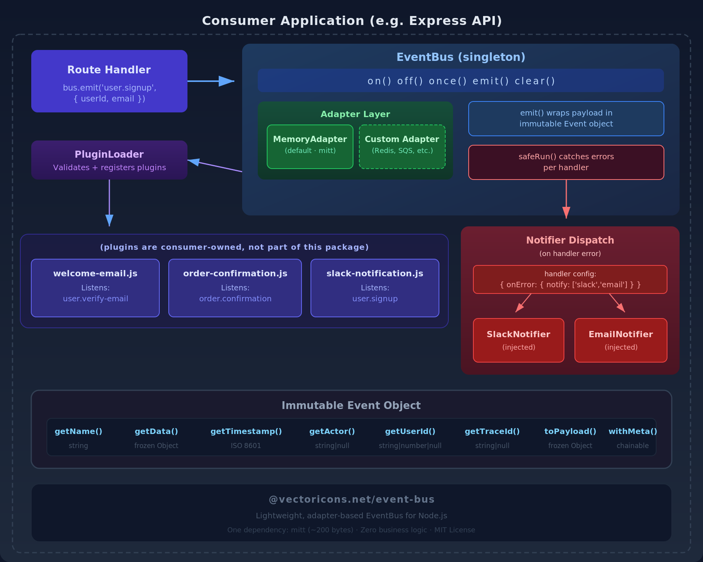

# @vectoricons.net/event-bus

A lightweight, adapter-based EventBus for Node.js with immutable event objects, a plugin registration system, and per-handler error notification.

## Architecture



## Features

- **Adapter-based** — ships with an in-memory adapter (backed by `mitt`). Swap in Redis, SQS, or any custom adapter by implementing the `BaseEventBusAdapter` interface.
- **Immutable events** — every emitted payload is wrapped in a deep-frozen `Event` object with name, timestamp, and optional actor/userId/traceId metadata.
- **Per-handler error notification** — each handler can declare which notifiers to invoke if it throws. Notifiers are injected at init time, keeping the package dependency-free.
- **Plugin system** — the `PluginLoader` validates plugins against a standard contract and wires their handlers onto the bus. Plugins are explicitly registered by the consumer — no auto-scanning.
- **Dynamic event types** — no built-in event constants. Consumers define their own via `registerEventType()` / `registerEventTypes()`.
- **Singleton management** — `initEventBus()` returns the same instance on repeated calls. `resetEventBus()` for testing.
- **Zero business logic** — the package is a generic pub/sub engine. All domain-specific behavior lives in consumer-owned plugins.

## Installation

```bash
npm install @vectoricons.net/event-bus
```

## Quick Start

```js
const {
    initEventBus,
    registerEventTypes,
    EventTypes,
    PluginLoader,
} = require('@vectoricons.net/event-bus');

// 1. Define your event types
registerEventTypes({
    USER_SIGNUP          : 'user.signup',
    USER_VERIFY_EMAIL    : 'user.verify-email',
    ORDER_CONFIRMATION   : 'order.confirmation',
});

// 2. Initialize the bus
const bus = initEventBus({
    notifiers : {
        slack : mySlackNotifier,   // your implementation of BaseNotifier
        email : myEmailNotifier,   // your implementation of BaseNotifier
    },
});

// 3. Register plugins
const loader = new PluginLoader(bus);
loader.register(require('./plugins/welcome-email'));
loader.register(require('./plugins/order-confirmation'));

// 4. Emit events from your application code
bus.emit(EventTypes.USER_SIGNUP, {
    userId : 42,
    email  : 'newuser@example.com',
});
```

## API Reference

### `initEventBus(options)`

Initialize the EventBus singleton. Returns the same instance on subsequent calls.

| Parameter | Type | Default | Description |
|---|---|---|---|
| `options.adapter` | `BaseEventBusAdapter` | `new MemoryAdapter()` | The pub/sub adapter |
| `options.notifiers` | `Object<string, BaseNotifier>` | `{}` | Named notifier instances |

```js
const bus = initEventBus({
    adapter   : new MemoryAdapter(),
    notifiers : { slack: mySlackNotifier },
});
```

### `getEventBus()`

Returns the current singleton, or `null` if not initialized.

### `resetEventBus()`

Clears all listeners and destroys the singleton. Intended for testing.

### `bus.on(event, handler, config?)`

Register a persistent listener.

```js
bus.on('user.signup', async (event) => {
    const { email } = event.getData();
    await sendWelcomeEmail(email);
}, {
    onError : { notify: ['slack'] },
});
```

### `bus.off(event, handler)`

Remove a previously registered listener.

### `bus.once(event, handler, config?)`

Register a one-time listener that auto-removes after the first invocation.

### `bus.emit(event, payload?)`

Emit an event. The payload is wrapped in an immutable `Event` object before dispatch. Returns `true` if emitted, `false` if no event name was provided.

```js
bus.emit('order.confirmation', {
    orderId : 'ord-123',
    userId  : 42,
    total   : 19.99,
});
```

### `bus.clear()`

Remove all listeners and reset internal handler tracking.

### `bus.setAdapter(adapter)`

Replace the adapter at runtime (e.g. swap Memory for Redis).

## Event Object

Every handler receives an `Event` instance with these methods:

| Method | Returns | Description |
|---|---|---|
| `getName()` | `string` | The event name |
| `getData()` | `Object` | The frozen payload |
| `getTimestamp()` | `string` | ISO 8601 creation time |
| `getActor()` | `string\|null` | Who triggered the event |
| `getUserId()` | `string\|number\|null` | Associated user ID |
| `getTraceId()` | `string\|null` | Correlation/trace ID |
| `toPayload()` | `Object` | Frozen plain object (for serialization) |
| `toString()` | `string` | JSON string |
| `withMeta({ actor, userId, traceId })` | `Event` | Set metadata (chainable) |

### Creating events manually

```js
const { Event } = require('@vectoricons.net/event-bus');

// Simple
const event = Event.create('user.login', { ip: '1.2.3.4' });

// With metadata
const event = Event.create('user.login', { ip: '1.2.3.4' })
    .withMeta({ actor: 'auth-service', userId: 42, traceId: 'abc-123' });

// From a serialized payload (e.g. from Redis, SQS)
const event = Event.fromPayload(JSON.parse(message));
```

## Event Types

The package ships with NO built-in event types. Define your own:

```js
const { registerEventType, registerEventTypes, EventTypes } = require('@vectoricons.net/event-bus');

// One at a time
registerEventType('USER_SIGNUP', 'user.signup');

// Bulk
registerEventTypes({
    USER_LOGIN               : 'user.login',
    USER_LOGOUT              : 'user.logout',
    ORDER_CONFIRMATION       : 'order.confirmation',
    ORDER_CANCEL_SUBSCRIPTION: 'order.cancel-subscription',
});

// Use them
bus.on(EventTypes.USER_SIGNUP, handler);
bus.emit(EventTypes.USER_SIGNUP, payload);

// Read-only — direct assignment throws
EventTypes.HACKED = 'nope'; // throws Error
```

### Naming convention

Use dot-separated lowercase strings for event values: `domain.action` or `domain.action.detail`.

```
user.signup
user.verify-email
order.confirmation
order.cancel-subscription
notify.email
notify.slack
```

## Plugins

A plugin is a plain object with a `name` and an `events` array:

```js
// plugins/welcome-email.js
module.exports = {
    name   : 'welcome-email',
    events : [
        {
            type    : 'user.verify-email',
            handler : async (event) => {
                const { userId, email } = event.getData();
                await mailService.sendEmail(email, 'welcome-offer', { userId });
            },
            config : { onError: { notify: ['slack', 'email'] } },
        },
    ],
};
```

### Plugin contract

| Property | Type | Required | Description |
|---|---|---|---|
| `name` | `string` | Yes | Unique plugin identifier |
| `events` | `Array<Object>` | Yes | Must contain at least one event definition |
| `events[].type` | `string` | Yes | Event name to listen for |
| `events[].handler` | `Function` | Yes | Async handler receiving an `Event` |
| `events[].config` | `Object` | No | Handler config (error notification, etc.) |
| `events[].once` | `boolean` | No | If `true`, handler fires once then unregisters |

### PluginLoader API

```js
const { PluginLoader } = require('@vectoricons.net/event-bus');
const loader = new PluginLoader(bus);

// Register one
loader.register(require('./plugins/welcome-email'));

// Register many
const { registered, skipped } = loader.registerAll([
    require('./plugins/welcome-email'),
    require('./plugins/order-confirmation'),
    require('./plugins/slack-notification'),
]);

// Query state
loader.isRegistered('welcome-email');  // true
loader.getRegisteredNames();           // ['welcome-email', 'order-confirmation', ...]
```

Invalid plugins are logged as warnings and skipped — they do not crash the application.

## Error Notification

When a handler throws, the EventBus catches the error, logs it, and dispatches to the notifiers specified in the handler's config:

```js
bus.on('order.process', riskyHandler, {
    onError : {
        notify : ['slack', 'email'],  // matches keys in initEventBus({ notifiers })
    },
});
```

Notifiers are injected at init time. The package ships only the `BaseNotifier` interface:

```js
const { BaseNotifier } = require('@vectoricons.net/event-bus');

class SlackNotifier extends BaseNotifier {
    constructor(channel) {
        super();
        this.channel = channel;
    }

    async notify(subject, error = null) {
        await slack.send(this.channel, `${subject}: ${error?.message}`);
    }
}
```

Notifier failures are caught internally and logged — they never propagate to the application.

## Custom Adapters

The default `MemoryAdapter` handles in-process pub/sub. For cross-process or distributed eventing, implement `BaseEventBusAdapter`:

```js
const { BaseEventBusAdapter } = require('@vectoricons.net/event-bus');

class RedisAdapter extends BaseEventBusAdapter {
    constructor({ publisher, subscriber, prefix = 'eventbus:' }) {
        super();
        this.publisher  = publisher;
        this.subscriber = subscriber;
        this.prefix     = prefix;
        this.handlers   = new Map();

        this.subscriber.on('message', (channel, message) => {
            const event = channel.replace(this.prefix, '');
            const set   = this.handlers.get(event);
            if (!set) return;
            for (const fn of set) fn(JSON.parse(message));
        });
    }

    on(event, handler) {
        if (!this.handlers.has(event)) {
            this.handlers.set(event, new Set());
            this.subscriber.subscribe(`${this.prefix}${event}`);
        }
        this.handlers.get(event).add(handler);
    }

    off(event, handler) { /* ... */ }
    once(event, handler) { /* ... */ }
    emit(event, payload) {
        this.publisher.publish(`${this.prefix}${event}`, JSON.stringify(payload));
    }
    clear() { /* ... */ }
}

// Use it
const bus = initEventBus({
    adapter : new RedisAdapter({ publisher: redisClient, subscriber: redisSub }),
});
```

## Testing

```bash
npm test
```

### Testing with EventBus in your application

Use `resetEventBus()` in your test setup to ensure a clean state:

```js
const { initEventBus, resetEventBus, MemoryAdapter } = require('@vectoricons.net/event-bus');

beforeEach(() => {
    resetEventBus();
    initEventBus({ adapter: new MemoryAdapter() });
});

afterEach(() => {
    resetEventBus();
});
```

## Full Integration Example

```js
// app.js — Express application setup
const express = require('express');
const {
    initEventBus,
    registerEventTypes,
    EventTypes,
    PluginLoader,
} = require('@vectoricons.net/event-bus');

// Define events
registerEventTypes({
    USER_SIGNUP        : 'user.signup',
    USER_VERIFY_EMAIL  : 'user.verify-email',
    ORDER_CONFIRMATION : 'order.confirmation',
});

// Initialize bus with notifiers
const bus = initEventBus({
    notifiers : {
        slack : new SlackNotifier('#site-errors'),
        email : new AdminEmailNotifier(process.env.ADMIN_EMAIL),
    },
});

// Load plugins
const loader = new PluginLoader(bus);
loader.register(require('./plugins/welcome-email'));
loader.register(require('./plugins/order-confirmation'));
loader.register(require('./plugins/slack-user-signup'));

// Express routes
const app = express();

app.post('/api/auth/register', async (req, res) => {
    const user = await createUser(req.body);

    // Emit event — plugins handle side effects
    bus.emit(EventTypes.USER_SIGNUP, {
        userId   : user.id,
        email    : user.email,
        username : user.username,
    });

    res.json({ success: true, user });
});

app.post('/api/order/webhook', async (req, res) => {
    const order = await processStripeWebhook(req.body);

    bus.emit(EventTypes.ORDER_CONFIRMATION, {
        orderId : order.id,
        userId  : order.userId,
        total   : order.total,
    });

    res.json({ received: true });
});
```

## Package Contents

```
@vectoricons.net/event-bus/
├── index.js                          # Public API
├── src/
│   ├── EventBus.js                   # Core pub/sub engine
│   ├── Event.js                      # Immutable event value object
│   ├── EventTypes.js                 # Dynamic event type registry
│   ├── PluginLoader.js               # Plugin validation + registration
│   ├── utils.js                      # deepFreeze utility
│   ├── adapters/
│   │   ├── BaseEventBusAdapter.js    # Adapter interface contract
│   │   └── MemoryAdapter.js          # Default in-memory adapter (mitt)
│   └── notifiers/
│       └── BaseNotifier.js           # Notifier interface contract
├── __tests__/
│   ├── EventBus.test.js
│   ├── EventTypes.test.js
│   └── PluginLoader.test.js
├── package.json
└── README.md
```

## Dependencies

| Package | Size | Purpose |
|---|---|---|
| `mitt` | ~200 bytes | Tiny event emitter used by MemoryAdapter |

That's it. One dependency.

## License

MIT
